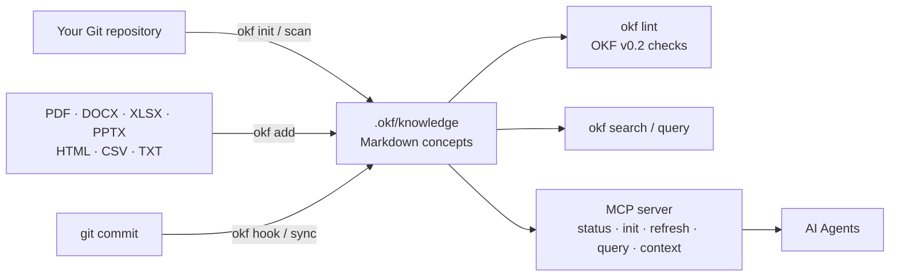

<div align="right">
[English](README.md) | [中文](README.zh-CN.md)
</div>

# okf — Open Knowledge Format

> Project-level knowledge base system for AI Agents, with automatic Git repository scanning, specification linting, and automated updates.

[](https://github.com/superops-team/okf/actions/workflows/go.yml)
[](https://github.com/superops-team/okf/releases)
[](go.mod)
[](#installation)
[](LICENSE)
[](https://github.com/superops-team/okf)
[](https://github.com/superops-team/okf/releases)

**okf** turns your Git repository into a living, queryable knowledge base that humans *and* AI Agents can use. Every piece of knowledge is a Markdown concept file with YAML frontmatter, generated from your code and documents automatically and kept up to date on every commit.

## Table of Contents

- [Features](#features)
- [How it works](#how-it-works)
- [Installation — Quick Start (30 seconds)](#installation--quick-start-30-seconds)
- [Usage](#usage)
- [Documentation](#documentation)
- [Project Structure](#project-structure)
- [Module Reference](#module-reference)
- [OKF Concept Format](#okf-concept-format)
- [API Usage](#api-usage)
- [Lint Rules](#lint-rules)
- [Build & Test](#build--test)
- [OKF v0.2 Specification Support](#okf-v02-specification-support)
- [Contributing](#contributing)
- [License](#license)

## Features

- **📁 Open Knowledge Format** — Open knowledge format based on Markdown + YAML Frontmatter
- **📄 Document Import** — Import PDF, DOCX, XLSX, PPTX, HTML, CSV, TXT directly (pure-Go conversion, no Python/CGO); `okf add report.pdf` just works
- **🔍 Auto-Generation** — Automatically generates knowledge base by scanning Git repository source code
- **⚡ Incremental Updates** — Incremental updates based on Git commits
- **🛠 Git Hook** — One-click installation, automatic knowledge base updates on every commit
- **📋 Lint Checking** — Built-in specification compliance checker (16 rules)
- **🔎 Advanced Query** — Filter by type, tags, or full-text search
- **🤖 Agent-facing MCP** — Standard MCP tools for repository status/init/refresh/query/context plus durable note/event/feedback capture
- **🏗 Modular Architecture** — Clean, layered design following Go best practices

## How it works



## Installation — Quick Start (30 seconds)

Pick one of these three install methods:

### 1. One-click installer (recommended)

**Linux / macOS:**

```bash
curl -fsSL https://raw.githubusercontent.com/superops-team/okf/main/scripts/install.sh | bash
```

**Windows (PowerShell):**

```powershell
irm https://raw.githubusercontent.com/superops-team/okf/main/scripts/install.ps1 | iex
```

> If the one-liner fails with `Unexpected token` / `&#34;` parse errors (caused by proxies HTML-encoding the response), use the download-then-run method:
> ```powershell
> iwr -useb "https://raw.githubusercontent.com/superops-team/okf/main/scripts/install.ps1" -OutFile install.ps1; .\install.ps1
> ```

The installer:
- Automatically detects your OS (Linux / macOS) and CPU architecture (amd64 / arm64)
- Downloads the latest pre-built binary from GitHub Releases
- Verifies SHA256 checksums
- Installs to `/usr/local/bin/` (or `~/.local/bin/` without sudo)

### 2. Install via Go

```bash
go install github.com/superops-team/okf/cmd/okf@latest
```

### 3. Download from releases

Download pre-built binaries for your platform from the
[Releases](https://github.com/superops-team/okf/releases) page.

| OS | Architecture | Archive |
|----|-------------|---------|
| Linux | amd64 (x86_64) | `okf_<version>_linux_amd64.tar.gz` |
| Linux | arm64 (aarch64) | `okf_<version>_linux_arm64.tar.gz` |
| macOS | amd64 (Intel) | `okf_<version>_darwin_amd64.tar.gz` |
| macOS | arm64 (Apple Silicon) | `okf_<version>_darwin_arm64.tar.gz` |
| Windows | amd64 | `okf_<version>_windows_amd64.zip` |
| Windows | arm64 | `okf_<version>_windows_arm64.zip` |

---

## Usage

```bash
# Initialize knowledge base from your repo
cd /your/repo
okf init

# Show knowledge base information
okf show

# Search concepts
okf search -q "database"

# Import a real document (converts PDF/DOCX/XLSX/... to Markdown)
okf add report.pdf

# Lint check
okf lint

# Install Git Hook (automatic updates on every commit)
okf hook -type post-commit

# Start the MCP server for a repository. Relative --dir values resolve under --repo;
# absolute --dir values remain absolute.
okf mcp --repo /your/repo --dir .okf/knowledge
```

### Agent-facing MCP tools

The MCP server exposes the repository knowledge service through `okf_status`, `okf_init`, `okf_refresh`, `okf_query`, and `okf_context`. Durable knowledge capture is available through `okf_note`, `okf_log`, and `okf_feedback`; `okf_ask` queries only those durable note/event/feedback concepts. Existing bundle/list/get/search/lint/document-import tools remain available.

Writes require a stable `idempotency_key`, use deterministic identities, reject unknown or incorrectly typed fields, and fail closed for path escape, symlink-root, size-limit, and credential-like metadata violations. The server persists only feedback explicitly submitted by the caller; it does not inspect a host application's private event bus. See [`docs/knowledge/mcp-server.md`](docs/knowledge/mcp-server.md) and [`docs/knowledge/durable-capture.md`](docs/knowledge/durable-capture.md).

## Documentation

- [Knowledge base index](docs/knowledge/index.md) — module overview
- [CLI reference](docs/knowledge/cli.md)
- [Lint rules](docs/knowledge/lint.md)
- [MCP server](docs/knowledge/mcp-server.md)
- [Durable knowledge capture](docs/knowledge/durable-capture.md)
- [v0.2 example — income statement](examples/v0.2/income-statement/)

## Project Structure

```
.
├── cmd/okf/          # CLI entry point
│   └── main.go      # Main application
├── pkg/
│   ├── okf/         # Core types and public API
│   │   ├── types.go # Concept, KnowledgeBundle definitions
│   │   ├── api.go   # LoadBundle, SaveBundle
│   │   ├── errors.go # Error types
│   │   ├── helpers.go # Helper functions
│   │   └── meta/    # Version information
│   ├── parser/      # Markdown + YAML parser
│   │   └── parser.go
│   ├── query/       # Query engine
│   │   └── query.go
│   ├── lint/        # Specification checker
│   │   └── lint.go
│   ├── git/         # Git integration
│   │   ├── git.go       # Git operations
│   │   └── generator.go # Knowledge base generation
│   ├── convert/     # Pure-Go document conversion (PDF/DOCX/XLSX/PPTX/HTML/CSV/TXT → Markdown)
│   ├── mcp/         # MCP server (status/init/refresh/query/context + durable capture)
│   └── tool/        # Durable note/event/feedback capture tools
├── go.mod
├── README.md            # English version (default)
└── README.zh-CN.md      # Chinese version
```

## Module Reference

| Module | Path | Purpose |
|--------|------|---------|
| **okf** | pkg/okf/ | Core type definitions (Concept, KnowledgeBundle) and public API |
| **parser** | pkg/parser/ | Markdown + YAML frontmatter parsing and serialization |
| **query** | pkg/query/ | Advanced query builder and matching engine |
| **lint** | pkg/lint/ | OKF specification compliance checking (16 rules) |
| **git** | pkg/git/ | Git repository scanning, code analysis, knowledge base generation |
| **convert** | pkg/convert/ | Pure-Go document import (PDF/DOCX/XLSX/PPTX/HTML/CSV/TXT/DOC → Markdown) |
| **mcp** | pkg/mcp/ | MCP server for AI agent integration |
| **tool** | pkg/tool/ | Durable note/event/feedback capture |

## OKF Concept Format

```markdown
---
type: table
title: users
description: User accounts table
resource: bigquery.project.dataset.users
tags:
  - production
  - pii
timestamp: "2024-01-15T10:30:00Z"
---

## Users Table
Stores all user account information.
```

## API Usage

```go
import (
    okf "github.com/superops-team/okf/pkg/okf"
    "github.com/superops-team/okf/pkg/git"
    "github.com/superops-team/okf/pkg/lint"
)

// Load knowledge base
bundle, err := okf.LoadBundle(".okf/knowledge", nil)

// Search concepts
results := bundle.Search("database")

// Lint check
result := lint.LintBundle(concepts, lint.DefaultConfig())

// Generate from Git
bundle, err := git.GenerateBundle(cfg, false)
```

## Lint Rules

| Code | Severity | Description |
|------|----------|-------------|
| OKF001 | ERROR | `type` field is required and must not be empty |
| OKF002 | WARNING | `title` is recommended but missing (derived from filename in v0.2) |
| OKF003 | WARNING | `description` is too short |
| OKF004 | INFO | `type` uses mixed case (valid for spec-defined types such as `Attested Computation`) |
| OKF005 | WARNING | `generated.at` is recommended but missing, or not a valid ISO 8601 timestamp |
| OKF006 | WARNING | tags contain uppercase or spaces |
| OKF007 | WARNING | content body is empty |
| OKF009 | WARNING | content lines are too long |
| OKF010 | WARNING | duplicate tags found |
| OKF011 | WARNING | required tag is missing |
| OKF012 | WARNING | `sources` is recommended but missing |
| OKF013 | WARNING | duplicate title across concepts |
| OKF014 | ERROR | Attested Computation requires `runtime` field |
| OKF015 | WARNING | `stale_after` is not a valid YYYY-MM-DD date |
| OKF016 | INFO | legacy `timestamp` detected; consider migrating to `generated.at` |
| OKF017 | INFO | `verified` is recommended to elevate the trust tier |

## Build & Test

```bash
# Build
go build ./...

# Build CLI
go build -o okf ./cmd/okf/

# Run all tests
go test ./...

# Run benchmarks
go test -bench=. -benchmem ./...
```

## OKF v0.2 Specification Support

This project implements the [OKF v0.2 specification](https://github.com/GoogleCloudPlatform/knowledge-catalog/blob/main/okf/SPEC.md) with full backward compatibility for v0.1.

### What's New in v0.2

- **Provenance** — `sources` field with material references, usage counts, and credibility signals
- **Trust** — `generated` (by/at) and `verified` (list of verification events) fields with trust tier derivation (unverified → machine-confirmed → human-reviewed)
- **Lifecycle** — `status` (stable/draft/deprecated) and `stale_after` (YYYY-MM-DD) fields
- **Attested Computation** — new concept type with `runtime`, `parameters`, `computation`, `executor`, and `attester` fields
- **Reserved filenames** — `index.md` (directory listing) and `log.md` (update history)
- **Only `type` is required** — `title` is now optional and derived from filename if missing

### Backward Compatibility

- v0.1 `timestamp` field is automatically mapped to `generated.at`
- v0.1 body `# Citations` section is automatically extracted to `sources`
- Legacy `generated: true` (boolean) is preserved for backward compatibility
- All v0.1 concepts parse without errors in v0.2 mode

### Official Example

See [`examples/v0.2/income-statement/`](examples/v0.2/income-statement/) for the complete Appendix A income statement example from the spec. The [v0.2 core types](docs/knowledge/core-types.md) document covers the full field reference.

## Contributing

Contributions are welcome! The project follows a strict SDD → TDD workflow:

1. **SDD** — write a change proposal under `openspec/changes/<change-id>/` (`proposal.md` / `design.md` / `spec.md` / `tasks.md`)
2. **TDD** — write tests first (red), then implement (green), then refactor
3. **Consistency** — land a `conformance.md` mapping spec ↔ implementation ↔ tests
4. **Gate** — every change must pass [`tools/gauntlet.sh`](tools/gauntlet.sh): build, vet, gofmt, staticcheck, tests with `-race`, coverage ≥ 60%, shuffle, and mutation testing

See [`AGENTS.md`](AGENTS.md) for the full development guide.

## License

Apache License 2.0. See the [LICENSE](LICENSE) file for the full license text.

---

<div align="center">
[⬆ Back to Top](#okf--open-knowledge-format) &nbsp;•&nbsp; [🇨🇳 切换到中文](README.zh-CN.md)
</div>
