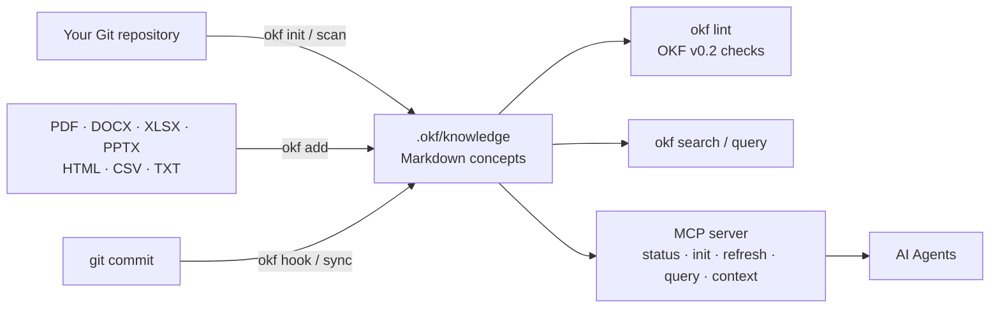

<p align="right">
<a href="README.md">English</a> | <a href="README.zh-CN.md">中文</a>
</p>

# okf — Open Knowledge Format

> Project-level knowledge base system for AI Agents, with automatic Git repository scanning, specification linting, and automated updates.

[](https://github.com/superops-team/okf/actions/workflows/go.yml)
[](https://github.com/superops-team/okf/releases)
[](go.mod)
[](#installation)
[](LICENSE)
[](https://github.com/superops-team/okf)
[](https://github.com/superops-team/okf/releases)

**okf** turns your Git repository into a living, queryable knowledge base that humans *and* AI Agents can use. Every piece of knowledge is a Markdown concept file with YAML frontmatter, generated from your code and documents automatically and kept up to date on every commit.

## Table of Contents

- [Features](#features)
- [How it works](#how-it-works)
- [Installation — Quick Start (30 seconds)](#installation--quick-start-30-seconds)
- [Usage](#usage)
- [Stable Identity, Manifest & Agent Discovery](#stable-identity-manifest--agent-discovery)
- [Documentation](#documentation)
- [Project Structure](#project-structure)
- [Module Reference](#module-reference)
- [OKF Concept Format](#okf-concept-format)
- [API Usage](#api-usage)
- [Lint Rules](#lint-rules)
- [Build & Test](#build--test)
- [OKF v0.2 Specification Support](#okf-v02-specification-support)
- [Contributing](#contributing)
- [License](#license)

## Features

- **📁 Open Knowledge Format** — Open knowledge format based on Markdown + YAML Frontmatter
- **📄 Document Import** — Import PDF, DOCX, XLSX, PPTX, HTML, CSV, TXT directly (pure-Go conversion, no Python/CGO); `okf add report.pdf` just works
- **🔍 Auto-Generation** — Automatically generates knowledge base by scanning Git repository source code
- **⚡ Incremental Updates** — Incremental updates based on Git commits
- **🛠 Git Hook** — One-click installation, automatic knowledge base updates on every commit
- **📋 Lint Checking** — Built-in specification compliance checker (16 rules)
- **🔎 Advanced Query** — Filter by type, tags, or full-text search
- **🧠 Hybrid Semantic Search** — Local natural-language search: chunk-level MiniLM embeddings + BM25, fused with weighted RRF; large imported documents also gain source-tracked derived chunks and per-source result deduplication (fully offline, no CGO)
- **🤖 Agent-facing MCP** — Standard MCP tools for repository status/init/refresh/query/context plus durable note/event/feedback capture
- **🏗 Modular Architecture** — Clean, layered design following Go best practices

## How it works



## Installation — Quick Start (30 seconds)

Pick one of these three install methods:

### 1. One-click installer (recommended)

**Linux / macOS:**

```bash
curl -fsSL https://raw.githubusercontent.com/superops-team/okf/main/scripts/install.sh | bash
```

**Windows (PowerShell):**

```powershell
irm https://raw.githubusercontent.com/superops-team/okf/main/scripts/install.ps1 | iex
```

> If the one-liner fails with `Unexpected token` / `&#34;` parse errors (caused by proxies HTML-encoding the response), use the download-then-run method:
> ```powershell
> iwr -useb "https://raw.githubusercontent.com/superops-team/okf/main/scripts/install.ps1" -OutFile install.ps1; .\install.ps1
> ```

The installer:
- Automatically detects your OS (Linux / macOS) and CPU architecture (amd64 / arm64)
- Downloads the latest pre-built binary from GitHub Releases
- Verifies SHA256 checksums
- Installs to `/usr/local/bin/` (or `~/.local/bin/` without sudo)

### 2. Install via Go

```bash
go install github.com/superops-team/okf/cmd/okf@latest
```

### 3. Download from releases

Download pre-built binaries for your platform from the
[Releases](https://github.com/superops-team/okf/releases) page.

| OS | Architecture | Archive |
|----|-------------|---------|
| Linux | amd64 (x86_64) | `okf_<version>_linux_amd64.tar.gz` |
| Linux | arm64 (aarch64) | `okf_<version>_linux_arm64.tar.gz` |
| macOS | amd64 (Intel) | `okf_<version>_darwin_amd64.tar.gz` |
| macOS | arm64 (Apple Silicon) | `okf_<version>_darwin_arm64.tar.gz` |
| Windows | amd64 | `okf_<version>_windows_amd64.zip` |
| Windows | arm64 | `okf_<version>_windows_arm64.zip` |

---

## Usage

```bash
# Initialize knowledge base from your repo
cd /your/repo
okf init

# Show knowledge base information
okf show

# Search concepts
okf search -q "database"

# Import a real document (converts PDF/DOCX/XLSX/... to Markdown)
okf add report.pdf

# Lint check
okf lint

# Semantic (natural-language) search — build the index once, then search
okf vector index
okf search -q "check my notes for errors" -semantic

# Install Git Hook (automatic updates on every commit)
okf hook -type post-commit

# Start the MCP server for a repository. Relative --dir values resolve under --repo;
# absolute --dir values remain absolute.
okf mcp --repo /your/repo --dir .okf/knowledge
```

### Agent-facing MCP tools

The MCP server exposes the repository knowledge service through `okf_status`, `okf_init`, `okf_refresh`, `okf_query`, and `okf_context`. Durable knowledge capture is available through `okf_note`, `okf_log`, and `okf_feedback`; `okf_ask` queries only those durable note/event/feedback concepts. Stable-ref resolution and metadata discovery are available through `okf_resolve` and `okf_manifest` (see [Stable Identity, Manifest & Agent Discovery](#stable-identity-manifest--agent-discovery)). Existing bundle/list/get/search/lint/document-import tools remain available.

Writes require a stable `idempotency_key`, use deterministic identities, reject unknown or incorrectly typed fields, and fail closed for path escape, symlink-root, size-limit, and credential-like metadata violations. The server persists only feedback explicitly submitted by the caller; it does not inspect a host application's private event bus. See [`docs/knowledge/mcp-server.md`](docs/knowledge/mcp-server.md) and [`docs/knowledge/durable-capture.md`](docs/knowledge/durable-capture.md).

## Semantic Search

`okf search -semantic` performs natural-language search over concepts, using a locally embedded MiniLM model (384-dim vectors) and an HNSW index — no network, no external runtime required. Long documents are split into heading-aware chunks, and results blend a **semantic** channel with a **BM25 lexical** channel via weighted Reciprocal Rank Fusion.

```bash
# Build (or incrementally update) the vector index — one-time, per knowledge base
okf vector index
# Inspect index state (chunks, concepts, index format version)
okf vector status
# Full rebuild (after content changes, or when upgrading index format)
okf vector rebuild
# Search semantically (hybrid: semantic + BM25, fused with weighted RRF)
okf search -q "check my notes for errors" -semantic
# Pure semantic, no lexical channel
okf search -q "how do I rebuild the index" -semantic -lexical-weight 0
```

Results are annotated with their source: `semantic`, `lexical`, or `both`. If no index exists, `-semantic` warns and falls back to lexical search. The MCP server exposes the same capability via `okf_semantic_search`.

### Measuring retrieval quality

`okf eval` scores retrieval against a golden query set and can compare strategies side by side:

```bash
okf eval -golden pkg/eval/testdata/golden_semantic.json -path docs/knowledge -compare
```

Measured on this repository's own knowledge base (28 queries, 26 positive, K=5):

| Strategy | Recall@5 | MRR |
|---|---|---|
| `lexical-substring` (pre-0.5.0 behaviour) | 0.0769 | 0.0769 |
| `bm25-only` | 0.8077 | 0.6538 |
| `semantic-only` | 0.9615 | 0.7096 |
| **`hybrid-default`** | **0.9615** | **0.7256** |

### How it works & constraints

- **Chunked indexing**: concepts are split on `##`–`####` headings into ≤1024-character chunks (code fences and tables are never split), each carrying a `Title > Section` breadcrumb. This matters because MiniLM truncates at 256 tokens: indexing whole concepts dropped **70.6%** of this repository's knowledge-base content, so text past the truncation point was unsearchable.
- **Hybrid retrieval**: the semantic channel (HNSW over chunk vectors) and the BM25 channel are fused with weighted RRF (`k=60`, equal weights by default). Tune with `-lexical-weight`; `0` disables the lexical channel. BM25 tokenizes identifiers into subwords (`okf_semantic_search` → `okf`/`semantic`/`search`) and CJK text into overlapping bigrams, with no dictionary dependency.
- **Reproducibility**: indexes below 2048 chunks are searched by exact scan rather than HNSW's approximate traversal, because the approximate path does not return every node even when asked for all of them, and which nodes it misses shifts between rebuilds. Combined with a fixed RNG seed and deterministic tie-breaks, this makes results identical across rebuilds — verified by rebuilding this knowledge base repeatedly and confirming the evaluation metrics do not move.
- **Index cost (measured, 7 concepts → 97 chunks)**: chunking increases index size ~20x (14.5 KB → 287 KB) and build time ~6x (128 ms → 800 ms). Both scale with content volume, not concept count.
- **Index format is not backward compatible**: chunk-level keys differ across index format generations. `okf vector status` reports the format version; loading a pre-v3 (v2) index fails with `index_rebuild_required` and names `okf vector rebuild` (search falls back to lexical meanwhile) rather than silently returning wrong results. The identity-aware **v3** keys are `v3:id:<okf_id>` for stable concepts and `v3:legacy:<fingerprint>` for legacy concepts; assigning stable IDs via `okf identity ensure --apply` also reports `vector_rebuild_required=true`.
- **Embedded resources**: the ONNX Runtime CPU library (per-OS, ~10–15 MB), the pure-tokenizers native library (~5–6 MB), a quantized MiniLM model (~23 MB), and `tokenizer.json` are embedded into the binary via `go:embed` and extracted to the user cache directory on first use (checksum-verified). Building for each platform only embeds that platform's resources (`scripts/fetch-ort.sh`, `scripts/fetch-tokenizers.sh`, and `scripts/fetch-model.sh` fetch them at build time; the runtime never goes online).
- **Dynamic loading (transparency)**: the ONNX Runtime and pure-tokenizers shared libraries are loaded at runtime via `dlopen` from the extracted cache — the binary is self-contained but not statically linked. Cache location: `os.UserCacheDir()/okf/` (override with `OKF_ORT_DIR`).
- **Large-document lifecycle**: document imports over 2000 words additionally persist source-tracked `__cN` concepts with heading context and `derived: true`. Semantic results are deduplicated by source document and report the hidden count as `dup=N`; this lets `okf sync -prune` remove generated whole/chunk files safely without touching author-owned files.
- **Limits**: MiniLM embeddings are English-centric. Persisted document chunks and BM25's CJK bigrams improve Chinese retrieval, but a purely Chinese query against English content still relies on the semantic channel alone. `Embedder` is an interface, leaving room for stronger models (e.g. BGE-M3) or remote APIs later.
- **Licenses**: pure-onnx (MIT), coder/hnsw (CC0-1.0), ONNX Runtime (MIT), MiniLM-L6-v2 model (Apache-2.0).

## Stable Identity, Manifest & Agent Discovery

This release adds optional stable concept identity, a metadata-only Manifest, hierarchical grouped retrieval, and project-scoped AI-agent integration. All additions are additive: legacy concepts without `okf_id` keep working unchanged, and omitting `group-by` preserves the existing ungrouped search output exactly.

### Optional stable identity (`okf_id`) and explicit migration

Concepts may carry an optional `okf_id` field matching `^okf_[0-9a-f]{32}$` (canonical URI `okf://concept/<okf_id>`). Concepts without it remain `legacy-unstable` and are fully valid — nothing about the required OKF v0.2 field set changes. IDs are only added through an explicit migration; there is no silent random assignment.

```bash
# Dry-run (default): lists planned additions, prints NO random IDs, leaves files byte-identical,
# and repeats deterministically (byte-identical JSON).
okf identity ensure --json
# Apply: validates the whole plan before writing, atomically replaces each file, and is idempotent
# (a second run reports zero changes).
okf identity ensure --apply
# Resolve a stable ref against the current bundle path (survives renames/moves).
okf identity resolve --ref okf://concept/okf_... --json
```

Duplicate or invalid IDs fail closed with `duplicate_concept_id` / `invalid_concept_id` before any file or index is touched; a cross-file write failure rolls back already-replaced files. MCP exposes the same resolution as `okf_resolve`.

### Vector index v3 requires an explicit rebuild

Stable concepts are keyed `v3:id:<okf_id>`; legacy concepts fall back to deterministic `v3:legacy:<fingerprint>`. A pre-v2 or v2 index is **never** mixed with v3 lookups: `okf vector status` reports `incompatible`, search/status returns `index_rebuild_required` and names `okf vector rebuild`. Assigning IDs with `okf identity ensure --apply` reports `vector_rebuild_required=true`.

### Metadata-only Manifest discovery (`okf tool manifest`)

`okf tool manifest` lists concepts by bounded **frontmatter and file metadata only** — it never reads Markdown bodies, loads embeddings, or builds/touches the vector index. Multi-megabyte bodies are bounded by the frontmatter bytes plus one 4 KiB read prefetch.

```bash
# Default: at most 100 items, offset 0, ordered by normalized path then ID.
okf tool manifest --json
# Pagination + filters (limit 1..500; within a dimension OR, across dimensions AND).
okf tool manifest --offset 100 --limit 50 --types source,note --tags go --json
```

Each item carries identity/ref, path, title/description, type, tags, effective status, trust tier, stale data, latest generated/verified timestamp, source count (≤3 source strings) and an `estimated_tokens = ceil(file_bytes/4)` label. Broken frontmatter omits only that file with a stable warning code (`manifest_frontmatter_missing|too_large|invalid`) and scanning continues. MCP exposes the identical contract as `okf_manifest`.

### Hierarchical grouped retrieval (`-group-by`)

Append `-group-by chunk|concept|source|folder` to `okf search` (and `-group-by` to `okf eval`) to project the already-fused, scored candidates into groups **before** final dedupe/TopK shaping. Omitting the flag keeps the existing ungrouped output and scores byte-for-byte unchanged.

```bash
# One representative per source (no source monopolization), plus hit/concept/source counts.
okf search -q "retrieval" -group-by source
# Group derived chunks under their parent concept; folder keys are bundle-relative "/", root is ".".
okf search -q "vector index" -group-by concept
```

The representative is always the first raw member (its score is unchanged, never re-aggregated into a sum). Folder projection rejects absolute paths and `..` escapes, falling back to concept grouping with a warning rather than producing unsafe keys. Any value outside the four groups fails with `invalid_group_by` (no silent fallback).

### Project-scoped agent integration (`okf agent`)

`okf agent plan|apply|status|remove` installs deterministic project-local configuration for **Cursor**, **Claude Code**, and **Codex** without touching user-global settings or storing any credentials.

```bash
# Plan is read-only: reports every proposed path/action/redacted hash and writes nothing.
okf agent plan --client cursor --format json
# Apply needs an explicit confirmation in non-interactive mode; it is idempotent (apply twice → zero diff)
# and preserves every unknown/owned-elsewhere config key and comment.
okf agent apply --client cursor --yes
okf agent apply --client cursor --yes   # second run: zero diff
okf agent status --client cursor
okf agent remove --client cursor --yes
```

Ownership is marked with the non-secret `OKF_MANAGED=agentconfig-v1` token. An existing entry that is malformed, unowned, or has unbalanced markers is reported as `conflict` and left byte-identical — there is no `--force`. Cursor uses `.cursor/mcp.json` + `.cursor/rules/okf.md`; Claude Code uses `.mcp.json` + `.claude/skills/okf/SKILL.md`; Codex uses `.codex/config.toml` + a managed `AGENTS.md` block. Use `--client all` (the default) for all three.

## Documentation

- [Knowledge base index](docs/knowledge/index.md) — module overview
- [CLI reference](docs/knowledge/cli.md)
- [Lint rules](docs/knowledge/lint.md)
- [MCP server](docs/knowledge/mcp-server.md)
- [Durable knowledge capture](docs/knowledge/durable-capture.md)
- [v0.2 example — income statement](examples/v0.2/income-statement/)

## Project Structure

```
.
├── cmd/okf/          # CLI entry point
│   └── main.go      # Main application
├── pkg/
│   ├── okf/         # Core types and public API
│   │   ├── types.go # Concept, KnowledgeBundle definitions
│   │   ├── api.go   # LoadBundle, SaveBundle
│   │   ├── errors.go # Error types
│   │   ├── helpers.go # Helper functions
│   │   └── meta/    # Version information
│   ├── parser/      # Markdown + YAML parser
│   │   └── parser.go
│   ├── query/       # Query engine
│   │   └── query.go
│   ├── lint/        # Specification checker
│   │   └── lint.go
│   ├── git/         # Git integration
│   │   ├── git.go       # Git operations
│   │   └── generator.go # Knowledge base generation
│   ├── convert/     # Pure-Go document conversion (PDF/DOCX/XLSX/PPTX/HTML/CSV/TXT → Markdown)
│   ├── mcp/         # MCP server (status/init/refresh/query/context + durable capture)
│   └── tool/        # Durable note/event/feedback capture tools
├── go.mod
├── README.md            # English version (default)
└── README.zh-CN.md      # Chinese version
```

## Module Reference

| Module | Path | Purpose |
|--------|------|---------|
| **okf** | pkg/okf/ | Core type definitions (Concept, KnowledgeBundle) and public API |
| **parser** | pkg/parser/ | Markdown + YAML frontmatter parsing and serialization |
| **query** | pkg/query/ | Advanced query builder and matching engine |
| **lint** | pkg/lint/ | OKF specification compliance checking (16 rules) |
| **git** | pkg/git/ | Git repository scanning, code analysis, knowledge base generation |
| **convert** | pkg/convert/ | Pure-Go document import (PDF/DOCX/XLSX/PPTX/HTML/CSV/TXT/DOC → Markdown) |
| **mcp** | pkg/mcp/ | MCP server for AI agent integration |
| **tool** | pkg/tool/ | Durable note/event/feedback capture |

## OKF Concept Format

```markdown
---
type: table
title: users
description: User accounts table
resource: bigquery.project.dataset.users
tags:
  - production
  - pii
timestamp: "2024-01-15T10:30:00Z"
---

## Users Table
Stores all user account information.
```

## API Usage

```go
import (
    okf "github.com/superops-team/okf/pkg/okf"
    "github.com/superops-team/okf/pkg/git"
    "github.com/superops-team/okf/pkg/lint"
)

// Load knowledge base
bundle, err := okf.LoadBundle(".okf/knowledge", nil)

// Search concepts
results := bundle.Search("database")

// Lint check
result := lint.LintBundle(concepts, lint.DefaultConfig())

// Generate from Git
bundle, err := git.GenerateBundle(cfg, false)
```

## Lint Rules

| Code | Severity | Description |
|------|----------|-------------|
| OKF001 | ERROR | `type` field is required and must not be empty |
| OKF002 | WARNING | `title` is recommended but missing (derived from filename in v0.2) |
| OKF003 | WARNING | `description` is too short |
| OKF004 | INFO | `type` uses mixed case (valid for spec-defined types such as `Attested Computation`) |
| OKF005 | WARNING | `generated.at` is recommended but missing, or not a valid ISO 8601 timestamp |
| OKF006 | WARNING | tags contain uppercase or spaces |
| OKF007 | WARNING | content body is empty |
| OKF009 | WARNING | content lines are too long |
| OKF010 | WARNING | duplicate tags found |
| OKF011 | WARNING | required tag is missing |
| OKF012 | WARNING | `sources` is recommended but missing |
| OKF013 | WARNING | duplicate title across concepts |
| OKF014 | ERROR | Attested Computation requires `runtime` field |
| OKF015 | WARNING | `stale_after` is not a valid YYYY-MM-DD date |
| OKF016 | INFO | legacy `timestamp` detected; consider migrating to `generated.at` |
| OKF017 | INFO | `verified` is recommended to elevate the trust tier |

## Build & Test

```bash
# Build
go build ./...

# Build CLI
go build -o okf ./cmd/okf/

# Run all tests
go test ./...

# Run benchmarks
go test -bench=. -benchmem ./...
```

## Evaluation

okf ships a reproducible IR (information-retrieval) quality benchmark that
quantifies search quality using canonical metrics.

### Metrics

| Metric | Definition |
|--------|-----------|
| **Recall@K** | Fraction of expected relevant docs found in top-K results |
| **Precision@K** | Fraction of top-K results that are relevant |
| **MRR** | Mean Reciprocal Rank — 1/rank of the first relevant result |
| **NDCG@K** | Normalized Discounted Cumulative Gain (binary relevance) |

### Running the benchmark

```bash
tools/eval.sh
```

This runs 20 golden queries (18 positive, 2 negative) across all 7 document
formats and prints per-case and aggregate scores.

### Baseline (K=5, 20 cases)

| Metric | All cases | Positive only |
|--------|-----------|---------------|
| Recall@5 | 1.0000 | 1.0000 |
| Precision@5 | 0.9000 | 1.0000 |
| MRR | 0.9000 | 1.0000 |
| NDCG@5 | 1.0000 | 1.0000 |

All 18 positive queries return the correct top-1; both negative queries
return zero results. The golden set lives in
`pkg/eval/testdata/golden_queries.json` and metric implementations in
`pkg/eval/`.

## OKF v0.2 Specification Support

This project implements the [OKF v0.2 specification](https://github.com/GoogleCloudPlatform/knowledge-catalog/blob/main/okf/SPEC.md) with full backward compatibility for v0.1.

### What's New in v0.2

- **Provenance** — `sources` field with material references, usage counts, and credibility signals
- **Trust** — `generated` (by/at) and `verified` (list of verification events) fields with trust tier derivation (unverified → machine-confirmed → human-reviewed)
- **Lifecycle** — `status` (stable/draft/deprecated) and `stale_after` (YYYY-MM-DD) fields
- **Attested Computation** — new concept type with `runtime`, `parameters`, `computation`, `executor`, and `attester` fields
- **Reserved filenames** — `index.md` (directory listing) and `log.md` (update history)
- **Only `type` is required** — `title` is now optional and derived from filename if missing

### Backward Compatibility

- v0.1 `timestamp` field is automatically mapped to `generated.at`
- v0.1 body `# Citations` section is automatically extracted to `sources`
- Legacy `generated: true` (boolean) is preserved for backward compatibility
- All v0.1 concepts parse without errors in v0.2 mode

### Official Example

See [`examples/v0.2/income-statement/`](examples/v0.2/income-statement/) for the complete Appendix A income statement example from the spec. The [v0.2 core types](docs/knowledge/core-types.md) document covers the full field reference.

## Contributing

Contributions are welcome! The project follows a strict SDD → TDD workflow:

1. **SDD** — write a change proposal under `openspec/changes/<change-id>/` (`proposal.md` / `design.md` / `spec.md` / `tasks.md`)
2. **TDD** — write tests first (red), then implement (green), then refactor
3. **Consistency** — land a `conformance.md` mapping spec ↔ implementation ↔ tests
4. **Gate** — every change must pass [`tools/gauntlet.sh`](tools/gauntlet.sh): build, vet, gofmt, staticcheck, tests with `-race`, coverage ≥ 60%, shuffle, and mutation testing

See [`AGENTS.md`](AGENTS.md) for the full development guide.

## License

Apache License 2.0. See the [LICENSE](LICENSE) file for the full license text.

---

<p align="center">
<a href="#okf--open-knowledge-format">⬆ Back to Top</a> &nbsp;•&nbsp; <a href="README.zh-CN.md">🇨🇳 切换到中文</a>
</p>
