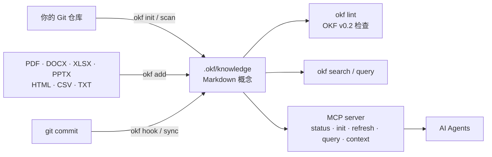

<p align="right">
<a href="README.md">English</a> | <a href="README.zh-CN.md">中文</a>
</p>

# okf — 开放知识格式 (Open Knowledge Format)

> 面向 AI Agent 的项目级知识库系统，支持从 Git 仓库自动生成知识、规范检查和自动化更新。

[](https://github.com/superops-team/okf/actions/workflows/go.yml)
[](https://github.com/superops-team/okf/releases)
[](go.mod)
[](#安装方式)
[](LICENSE)
[](https://github.com/superops-team/okf)
[](https://github.com/superops-team/okf/releases)

**okf** 把你的 Git 仓库变成一个可实时查询、人和 AI Agent 都能用的知识库。每一条知识都是一个带 YAML Frontmatter 的 Markdown 概念文件，从代码和文档自动生成，并在每次提交时自动更新。

## 目录

- [功能特性](#功能特性)
- [工作原理](#工作原理)
- [安装方式 · 30 秒上手](#安装方式--30-秒上手)
- [使用示例](#使用示例)
- [文档](#文档)
- [项目结构](#项目结构)
- [模块说明](#模块说明)
- [OKF 概念格式](#okf-概念格式)
- [API 使用](#api-使用)
- [Lint 规则](#lint-规则)
- [构建与测试](#构建与测试)
- [OKF v0.2 规范支持](#okf-v02-规范支持)
- [参与贡献](#参与贡献)
- [License](#license)

## 功能特性

- **📁 开放知识格式** — 基于 Markdown + YAML Frontmatter 的开放知识格式
- **📄 文档导入** — 直接导入 PDF、DOCX、XLSX、PPTX、HTML、CSV、TXT（纯 Go 转换，无需 Python/CGO）；`okf add report.pdf` 开箱即用
- **🔍 自动生成** — 扫描 Git 仓库代码，自动生成项目知识库
- **⚡ 增量更新** — 基于 Git 提交的增量更新，快速高效
- **🛠 Git Hook** — 一键安装，每次提交自动更新知识库
- **📋 Lint 检查** — 内置规范检查（16 条规则）
- **🔎 高级查询** — 支持按类型、标签、全文搜索
- **🧠 语义搜索** — 对概念进行本地自然语言搜索（内嵌 MiniLM 模型，完全离线、无 CGO）
- **🤖 Agent MCP 接入** — 通过标准 MCP 提供仓库知识状态、初始化、刷新、查询、上下文以及持久 note/event/feedback
- **🏗 模块化架构** — 遵循 Go 最佳实践，清晰分层设计

## 工作原理



## 安装方式 · 30 秒上手

从以下三种方式中任选一种：

### 1. 一键安装脚本（推荐）

**Linux / macOS：

```bash
curl -fsSL https://raw.githubusercontent.com/superops-team/okf/main/scripts/install.sh | bash
```

**Windows (PowerShell)：**

```powershell
irm https://raw.githubusercontent.com/superops-team/okf/main/scripts/install.ps1 | iex
```

> 如果一行命令报 `Unexpected token` / `&#34;` 解析错误（通常是代理将响应做了 HTML 编码导致），请改用先下载再执行的方式：
> ```powershell
> iwr -useb "https://raw.githubusercontent.com/superops-team/okf/main/scripts/install.ps1" -OutFile install.ps1; .\install.ps1
> ```

安装脚本功能：
- 自动检测操作系统（Linux / macOS / Windows）与 CPU 架构（amd64 / arm64）
- 从 GitHub Releases 下载最新预编译二进制
- 校验 SHA256 完整性
- 安装到 `/usr/local/bin/`（无需 sudo 时使用 `~/.local/bin/`）

### 2. 通过 Go 安装

```bash
go install github.com/superops-team/okf/cmd/okf@latest
```

### 3. 手动下载 Release 二进制

从 [Releases](https://github.com/superops-team/okf/releases) 页面下载你平台对应的预编译文件。

| 操作系统 | 架构 | 文件名 |
|--------|------|--------|
| Linux | amd64 (x86_64) | `okf_<version>_linux_amd64.tar.gz` |
| Linux | arm64 (aarch64) | `okf_<version>_linux_arm64.tar.gz` |
| macOS | amd64 (Intel) | `okf_<version>_darwin_amd64.tar.gz` |
| macOS | arm64 (Apple Silicon) | `okf_<version>_darwin_arm64.tar.gz` |
| Windows | amd64 | `okf_<version>_windows_amd64.zip` |
| Windows | arm64 | `okf_<version>_windows_arm64.zip` |

---

## 使用示例

```bash
# 初始化知识库
cd /your/repo
okf init

# 查看知识库信息
okf show

# 搜索
okf search -q "database"

# 导入真实文档（自动将 PDF/DOCX/XLSX/... 转换为 Markdown）
okf add report.pdf

# Lint 检查
okf lint

# 语义（自然语言）搜索 —— 先构建一次索引，再搜索
okf vector index
okf search -q "检查我的笔记有没有错误" -semantic

# 安装 Git Hook（每次提交自动更新）
okf hook -type post-commit

# 为指定仓库启动 MCP server。相对 --dir 解析到 --repo 下，绝对 --dir 保持绝对。
okf mcp --repo /your/repo --dir .okf/knowledge
```

### Agent-facing MCP 工具

MCP server 通过 `okf_status`、`okf_init`、`okf_refresh`、`okf_query`、`okf_context` 暴露仓库知识服务；通过 `okf_note`、`okf_log`、`okf_feedback` 持久化显式提交的知识，并由 `okf_ask` 仅查询 note/event/feedback。原有 bundle/list/get/search/lint/document-import 工具保持可用。

写工具要求稳定的 `idempotency_key`，使用确定性 identity，拒绝未知字段和错误字段类型，并对路径逃逸、symlink root、大小超限和 credential-like metadata 采取 fail-closed。Server 只持久化调用方显式提交的 feedback，不读取宿主应用的私有事件总线。详见 [`docs/knowledge/mcp-server.md`](docs/knowledge/mcp-server.md) 和 [`docs/knowledge/durable-capture.md`](docs/knowledge/durable-capture.md)。

## 语义搜索

`okf search -semantic` 对概念进行自然语言搜索：使用本地内嵌的 MiniLM 模型（384 维向量）与 HNSW 索引，全程无网络、无需外部运行时。

```bash
# 构建（或增量更新）向量索引 —— 每个知识库一次
okf vector index
# 查看索引状态
okf vector status
# 内容变更后全量重建
okf vector rebuild
# 语义搜索（经 RRF 融合语义 + 词法结果）
okf search -q "检查我的笔记有没有错误" -semantic
```

结果会标注来源：`semantic` / `lexical` / `both`。索引未构建时 `-semantic` 会给出警告并回退到词法搜索。MCP server 通过 `okf_semantic_search` 暴露相同能力。

### 实现方式与限制

- **内嵌资源**：ONNX Runtime CPU 库（按 OS，约 10–15 MB）与量化 MiniLM 模型（约 23 MB）通过 `go:embed` 内嵌进二进制，首次使用时解包到用户缓存目录（带 SHA256 校验）。每个平台构建只内嵌该平台资源（`scripts/fetch-ort.sh` / `scripts/fetch-model.sh` 在构建期获取，运行时零联网）。
- **动态加载（如实声明）**：ONNX Runtime 动态库在运行时通过 `dlopen` 从缓存目录加载——二进制自包含但并非静态链接。缓存位置：`os.UserCacheDir()/okf/`（可用 `OKF_ORT_DIR` 覆盖）。
- **限制**：MiniLM 对每个概念截断到 256 token；模型以英文语义为主，中文语义质量有限（词法搜索仍可用）。`Embedder` 是接口，为后续更强模型（如 BGE-M3）或远程 API 预留替换点。
- **许可**：pure-onnx（MIT）、coder/hnsw（CC0-1.0）、ONNX Runtime（MIT）、MiniLM-L6-v2 模型（Apache-2.0）。

## 文档

- [知识库索引](docs/knowledge/index.md) — 模块总览
- [CLI 命令参考](docs/knowledge/cli.md)
- [Lint 规则](docs/knowledge/lint.md)
- [MCP Server](docs/knowledge/mcp-server.md)
- [持久化知识捕获](docs/knowledge/durable-capture.md)
- [v0.2 示例 — income statement](examples/v0.2/income-statement/)

## 项目结构

```
.
├── cmd/okf/          # CLI 入口程序
│   └── main.go      # 主入口
├── pkg/
│   ├── okf/         # 核心类型和公共 API
│   │   ├── types.go # Concept, KnowledgeBundle 类型定义
│   │   ├── api.go   # 加载/保存 bundle
│   │   ├── errors.go # 错误类型
│   │   ├── helpers.go # 辅助函数
│   │   └── meta/    # 版本信息
│   ├── parser/      # Markdown + YAML 解析器
│   │   └── parser.go
│   ├── query/       # 查询引擎
│   │   └── query.go
│   ├── lint/        # 规范检查
│   │   └── lint.go
│   ├── git/         # Git 集成
│   │   ├── git.go       # Git 操作
│   │   └── generator.go # 知识库生成
│   ├── convert/     # 纯 Go 文档转换（PDF/DOCX/XLSX/PPTX/HTML/CSV/TXT → Markdown）
│   ├── mcp/         # MCP server（status/init/refresh/query/context + 持久化捕获）
│   └── tool/        # 持久化 note/event/feedback 捕获工具
├── go.mod
├── README.md            # 英文版（默认）
└── README.zh-CN.md      # 中文版
```

## 模块说明

| 模块 | 路径 | 功能 |
|--------|------|------|
| **okf** | pkg/okf/ | 核心类型定义（Concept, KnowledgeBundle）和公共 API |
| **parser** | pkg/parser/ | Markdown + YAML frontmatter 解析和序列化 |
| **query** | pkg/query/ | 高级查询构建器和匹配引擎 |
| **lint** | pkg/lint/ | OKF 规范检查（16 条规则） |
| **git** | pkg/git/ | Git 仓库扫描、代码分析、知识库生成 |
| **convert** | pkg/convert/ | 纯 Go 文档导入（PDF/DOCX/XLSX/PPTX/HTML/CSV/TXT/DOC → Markdown） |
| **mcp** | pkg/mcp/ | 面向 AI Agent 的 MCP server |
| **tool** | pkg/tool/ | 持久化 note/event/feedback 捕获 |

## OKF 概念格式

```markdown
---
type: table
title: users
description: 用户账户表
resource: bigquery.project.dataset.users
tags:
  - production
  - pii
timestamp: "2024-01-15T10:30:00Z"
---

## 用户表
存储所有用户账户信息。
```

## API 使用

```go
import (
    okf "github.com/superops-team/okf/pkg/okf"
    "github.com/superops-team/okf/pkg/git"
    "github.com/superops-team/okf/pkg/lint"
)

// 加载知识库
bundle, err := okf.LoadBundle(".okf/knowledge", nil)

// 搜索
results := bundle.Search("database")

// Lint 检查
result := lint.LintBundle(concepts, lint.DefaultConfig())

// 从 Git 生成
bundle, err := git.GenerateBundle(cfg, false)
```

## Lint 规则

| 代码 | 严重度 | 说明 |
|------|--------|------|
| OKF001 | ERROR | `type` 字段不能为空 |
| OKF002 | WARNING | 建议提供 `title`（v0.2 中缺失时由文件名推导） |
| OKF003 | WARNING | `description` 太短 |
| OKF004 | INFO | `type` 使用混合大小写（规范定义类型如 `Attested Computation` 允许） |
| OKF005 | WARNING | 建议提供 `generated.at`，或格式不是合法 ISO 8601 |
| OKF006 | WARNING | 标签包含大写或空格 |
| OKF007 | WARNING | 内容体为空 |
| OKF009 | WARNING | 内容行过长 |
| OKF010 | WARNING | 重复标签 |
| OKF011 | WARNING | 缺少必需标签 |
| OKF012 | WARNING | 建议提供 `sources` |
| OKF013 | WARNING | 概念间存在重复标题 |
| OKF014 | ERROR | Attested Computation 必须提供 `runtime` 字段 |
| OKF015 | WARNING | `stale_after` 不是合法的 YYYY-MM-DD 日期 |
| OKF016 | INFO | 检测到旧版 `timestamp`，建议迁移到 `generated.at` |
| OKF017 | INFO | 建议提供 `verified` 以提升信任层级 |

## 构建与测试

```bash
# 构建所有包
go build ./...

# 编译 CLI
go build -o okf ./cmd/okf/

# 运行所有测试
go test ./...

# 运行基准测试
go test -bench=. -benchmem ./...
```

## OKF v0.2 规范支持

本项目实现了 [OKF v0.2 规范](https://github.com/GoogleCloudPlatform/knowledge-catalog/blob/main/okf/SPEC.md)，并完整兼容 v0.1。

### v0.2 新增内容

- **溯源（Provenance）** — `sources` 字段，含材料引用、使用次数与可信度信号
- **信任（Trust）** — `generated`（by/at）与 `verified`（验证事件列表）字段，支持信任层级推导（unverified → machine-confirmed → human-reviewed）
- **生命周期（Lifecycle）** — `status`（stable/draft/deprecated）与 `stale_after`（YYYY-MM-DD）字段
- **Attested Computation** — 新增概念类型，含 `runtime`、`parameters`、`computation`、`executor`、`attester` 字段
- **保留文件名** — `index.md`（目录索引）与 `log.md`（更新历史）
- **仅 `type` 必填** — `title` 变为可选，缺失时由文件名推导

### 向后兼容

- v0.1 的 `timestamp` 字段自动映射为 `generated.at`
- v0.1 正文中的 `# Citations` 章节自动提取为 `sources`
- 旧版 `generated: true`（布尔值）保留以兼容
- 所有 v0.1 概念在 v0.2 模式下均可无错误解析

### 官方示例

完整的 Appendix A income statement 示例见 [`examples/v0.2/income-statement/`](examples/v0.2/income-statement/)。完整字段参考见 [v0.2 核心类型文档](docs/knowledge/core-types.md)。

## 参与贡献

欢迎贡献！本项目遵循严格的 SDD → TDD 工作流：

1. **SDD** — 在 `openspec/changes/<change-id>/` 编写变更提案（`proposal.md` / `design.md` / `spec.md` / `tasks.md`）
2. **TDD** — 先写测试（red），再最小实现（green），最后重构
3. **一致性** — 落地 `conformance.md`，对照 spec ↔ 实现 ↔ 测试
4. **门槛** — 每个变更必须通过 [`tools/gauntlet.sh`](tools/gauntlet.sh)：build、vet、gofmt、staticcheck、`-race` 测试、覆盖率 ≥ 60%、shuffle 与变异测试

完整开发指南见 [`AGENTS.md`](AGENTS.md)。

## License

Apache License 2.0。完整许可文本见 [LICENSE](LICENSE) 文件。

---

<p align="center">
<a href="#okf--开放知识格式-open-knowledge-format">⬆ 返回顶部</a> &nbsp;•&nbsp; <a href="README.md">🇬🇧 Switch to English</a>
</p>
