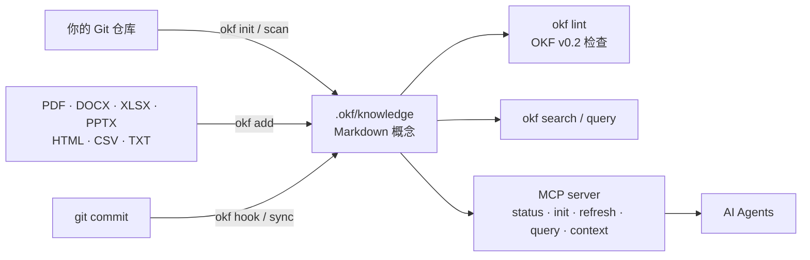

<p align="right">
<a href="README.md">English</a> | <a href="README.zh-CN.md">中文</a>
</p>

# okf — 开放知识格式 (Open Knowledge Format)

> 面向 AI Agent 的项目级知识库系统，支持从 Git 仓库自动生成知识、规范检查和自动化更新。

[](https://github.com/superops-team/okf/actions/workflows/go.yml)
[](https://github.com/superops-team/okf/releases)
[](go.mod)
[](#安装方式)
[](LICENSE)
[](https://github.com/superops-team/okf)
[](https://github.com/superops-team/okf/releases)

**okf** 把你的 Git 仓库变成一个可实时查询、人和 AI Agent 都能用的知识库。每一条知识都是一个带 YAML Frontmatter 的 Markdown 概念文件，从代码和文档自动生成，并在每次提交时自动更新。

## 目录

- [功能特性](#功能特性)
- [工作原理](#工作原理)
- [安装方式 · 30 秒上手](#安装方式--30-秒上手)
- [使用示例](#使用示例)
- [稳定身份、Manifest 与 Agent 发现](#稳定身份manifest-与-agent-发现)
- [时序记忆与评审工作流](#时序记忆与评审工作流)
- [文档](#文档)
- [项目结构](#项目结构)
- [模块说明](#模块说明)
- [OKF 概念格式](#okf-概念格式)
- [API 使用](#api-使用)
- [Lint 规则](#lint-规则)
- [构建与测试](#构建与测试)
- [OKF v0.2 规范支持](#okf-v02-规范支持)
- [参与贡献](#参与贡献)
- [License](#license)

## 功能特性

- **📁 开放知识格式** — 基于 Markdown + YAML Frontmatter 的开放知识格式
- **📄 文档导入** — 直接导入 PDF、DOCX、XLSX、PPTX、HTML、CSV、TXT（纯 Go 转换，无需 Python/CGO）；`okf add report.pdf` 开箱即用
- **🔍 自动生成** — 扫描 Git 仓库代码，自动生成项目知识库
- **⚡ 增量更新** — 基于 Git 提交的增量更新，快速高效
- **🛠 Git Hook** — 一键安装，每次提交自动更新知识库
- **📋 Lint 检查** — 内置规范检查（16 条规则）
- **🔎 高级查询** — 支持按类型、标签、全文搜索
- **🧠 混合语义搜索** — 本地自然语言搜索：分块级 MiniLM 向量 + BM25，加权 RRF 融合（完全离线、无 CGO）
- **🤖 Agent MCP 接入** — 通过标准 MCP 提供仓库知识状态、初始化、刷新、查询、上下文以及持久 note/event/feedback
- [⏳ 时序记忆与评审](#时序记忆与评审工作流) — `updates`/`extends` 关系、current/all/history 视图，以及 propose→approve/decline/undo 的对比并集评审队列（无图数据库，currentness 实时计算）
- **🏗 模块化架构** — 遵循 Go 最佳实践，清晰分层设计

## 工作原理


```mermaid
flowchart LR
    A[你的 Git 仓库] -->|"okf init / scan"| B[.okf/knowledge<br/>Markdown 概念]
    C["PDF · DOCX · XLSX · PPTX<br/>HTML · CSV · TXT"] -->|"okf add"| B
    D[git commit] -->|"okf hook / sync"| B
    B --> E["okf lint<br/>OKF v0.2 检查"]
    B --> F["okf search / query"]
    B --> G["MCP server<br/>status · init · refresh · query · context"]
    G --> H[AI Agents]
```

## 安装方式 · 30 秒上手

从以下三种方式中任选一种：

### 1. 一键安装脚本（推荐）

**Linux / macOS：

```bash
curl -fsSL https://raw.githubusercontent.com/superops-team/okf/main/scripts/install.sh | bash
```

**Windows (PowerShell)：**

```powershell
irm https://raw.githubusercontent.com/superops-team/okf/main/scripts/install.ps1 | iex
```

> 如果一行命令报 `Unexpected token` / `&#34;` 解析错误（通常是代理将响应做了 HTML 编码导致），请改用先下载再执行的方式：
> ```powershell
> iwr -useb "https://raw.githubusercontent.com/superops-team/okf/main/scripts/install.ps1" -OutFile install.ps1; .\install.ps1
> ```

安装脚本功能：
- 自动检测操作系统（Linux / macOS / Windows）与 CPU 架构（amd64 / arm64）
- 从 GitHub Releases 下载最新预编译二进制
- 校验 SHA256 完整性
- 安装到 `/usr/local/bin/`（无需 sudo 时使用 `~/.local/bin/`）

### 2. 通过 Go 安装

```bash
go install github.com/superops-team/okf/cmd/okf@latest
```

### 3. 手动下载 Release 二进制

从 [Releases](https://github.com/superops-team/okf/releases) 页面下载你平台对应的预编译文件。

| 操作系统 | 架构 | 文件名 |
|--------|------|--------|
| Linux | amd64 (x86_64) | `okf_<version>_linux_amd64.tar.gz` |
| Linux | arm64 (aarch64) | `okf_<version>_linux_arm64.tar.gz` |
| macOS | amd64 (Intel) | `okf_<version>_darwin_amd64.tar.gz` |
| macOS | arm64 (Apple Silicon) | `okf_<version>_darwin_arm64.tar.gz` |
| Windows | amd64 | `okf_<version>_windows_amd64.zip` |
| Windows | arm64 | `okf_<version>_windows_arm64.zip` |

---

## 使用示例

```bash
# 初始化知识库
cd /your/repo
okf init

# 查看知识库信息
okf show

# 搜索
okf search -q "database"

# 导入真实文档（自动将 PDF/DOCX/XLSX/... 转换为 Markdown）
okf add report.pdf

# Lint 检查
okf lint

# 语义（自然语言）搜索 —— 先构建一次索引，再搜索
okf vector index
okf search -q "检查我的笔记有没有错误" -semantic

# 安装 Git Hook（每次提交自动更新）
okf hook -type post-commit

# 为指定仓库启动 MCP server。相对 --dir 解析到 --repo 下，绝对 --dir 保持绝对。
okf mcp --repo /your/repo --dir .okf/knowledge
```

### Agent-facing MCP 工具

MCP server 通过 `okf_status`、`okf_init`、`okf_refresh`、`okf_query`、`okf_context` 暴露仓库知识服务；通过 `okf_note`、`okf_log`、`okf_feedback` 持久化显式提交的知识，并由 `okf_ask` 仅查询 note/event/feedback。稳定引用解析与元数据发现通过 `okf_resolve`、`okf_manifest` 暴露（见[稳定身份、Manifest 与 Agent 发现](#稳定身份manifest-与-agent-发现)）。新增 `okf_memory_review`（propose→approve/decline/undo 的 CAS 评审工具）在两个时代均可用，工具数量相应变为现代 12 个、legacy 21 个。原有 bundle/list/get/search/lint/document-import 工具保持可用。

写工具要求稳定的 `idempotency_key`，使用确定性 identity，拒绝未知字段和错误字段类型，并对路径逃逸、symlink root、大小超限和 credential-like metadata 采取 fail-closed。Server 只持久化调用方显式提交的 feedback，不读取宿主应用的私有事件总线。详见 [`docs/knowledge/mcp-server.md`](docs/knowledge/mcp-server.md) 和 [`docs/knowledge/durable-capture.md`](docs/knowledge/durable-capture.md)。

## 语义搜索

`okf search -semantic` 对概念进行自然语言搜索：使用本地内嵌的 MiniLM 模型（384 维向量）与 HNSW 索引，全程无网络、无需外部运行时。长文档会按标题切分为分块索引，检索结果由**语义通道**与 **BM25 词法通道**经加权 RRF 融合得出。

```bash
# 构建（或增量更新）向量索引 —— 每个知识库一次
okf vector index
# 查看索引状态（分块数、概念数、索引格式版本）
okf vector status
# 内容变更后全量重建（升级索引格式时同样需要）
okf vector rebuild
# 语义搜索（混合：语义 + BM25，加权 RRF 融合）
okf search -q "检查我的笔记有没有错误" -semantic
# 纯语义，关闭词法通道
okf search -q "如何重建索引" -semantic -lexical-weight 0
```

结果会标注来源：`semantic` / `lexical` / `both`。索引未构建时 `-semantic` 会给出警告并回退到词法搜索。MCP server 通过 `okf_semantic_search` 暴露相同能力。

### 检索质量度量

`okf eval` 基于 golden query set 打分，并可横向对比多种策略：

```bash
okf eval -golden pkg/eval/testdata/golden_semantic.json -path docs/knowledge -compare
```

在本仓库自身知识库上的实测结果（28 条查询，26 条正样本，K=5）：

| 策略 | Recall@5 | MRR |
|---|---|---|
| `lexical-substring`（0.5.0 之前的行为） | 0.0769 | 0.0769 |
| `bm25-only` | 0.8077 | 0.6538 |
| `semantic-only` | 0.9615 | 0.7096 |
| **`hybrid-default`** | **0.9615** | **0.7256** |

### 实现方式与限制

- **分块索引**：概念按 `##`–`####` 标题切分为不超过 1024 字符的块（代码围栏与表格不会被切开），每块携带 `标题 > 章节` 的 breadcrumb。这一步是必要的：MiniLM 在 256 token 处截断，按整个概念建索引会使本仓库知识库 **70.6%** 的内容进不了索引，截断点之后的文本完全搜不到。
- **混合检索**：语义通道（分块向量的 HNSW 检索）与 BM25 通道经加权 RRF 融合（`k=60`，默认等权）。可用 `-lexical-weight` 调节，设为 `0` 即关闭词法通道。BM25 会把标识符拆成子词（`okf_semantic_search` → `okf`/`semantic`/`search`），中文切为重叠 bigram，不依赖词典。
- **可复现性**：块数低于 2048 的索引走全量精确扫描，而非 HNSW 的近似遍历——近似路径即使请求全部节点也不会全部返回，且遗漏项随重建而变。配合固定随机种子与确定性 tie-break，检索结果在多次重建之间完全一致；该性质通过反复重建本知识库、确认评测指标不发生变化来验证。
- **索引成本（实测，7 概念 → 97 块）**：分块使索引体积增大约 20 倍（14.5 KB → 287 KB），构建耗时增加约 6 倍（128 ms → 800 ms）。两者随内容量增长，而非随概念数增长。
- **索引格式不向下兼容**：跨代际的分块级 key 各不相同。`okf vector status` 会显示格式版本；加载 v3 之前（v2）的旧索引会报 `index_rebuild_required` 并提示执行 `okf vector rebuild`（此期间检索回退到词法），而不是静默返回错误结果。身份感知的 **v3** key：稳定概念为 `v3:id:<okf_id>`，遗留概念回退到确定性的 `v3:legacy:<fingerprint>`。通过 `okf identity ensure --apply` 分配 ID 时也会报告 `vector_rebuild_required=true`。
- **内嵌资源**：ONNX Runtime CPU 库（按 OS，约 10–15 MB）、pure-tokenizers 原生库（约 5–6 MB）、量化 MiniLM 模型（约 23 MB）和 `tokenizer.json` 均通过 `go:embed` 内嵌进二进制，首次使用时解包到用户缓存目录（带 SHA256 校验）。每个平台构建只内嵌该平台资源（`scripts/fetch-ort.sh`、`scripts/fetch-tokenizers.sh`、`scripts/fetch-model.sh` 在构建期获取，运行时零联网）。
- **动态加载（如实声明）**：ONNX Runtime 与 pure-tokenizers 动态库在运行时通过 `dlopen` 从缓存目录加载——二进制自包含但并非静态链接。缓存位置：`os.UserCacheDir()/okf/`（可用 `OKF_ORT_DIR` 覆盖）。
- **限制**：MiniLM 以英文语义为主。分块与 BM25 的中文 bigram 提升了中文检索效果，但纯中文 query 检索英文内容时仍只能依赖语义通道。`Embedder` 是接口，为后续更强模型（如 BGE-M3）或远程 API 预留替换点。
- **许可**：pure-onnx（MIT）、coder/hnsw（CC0-1.0）、ONNX Runtime（MIT）、MiniLM-L6-v2 模型（Apache-2.0）。

## 稳定身份、Manifest 与 Agent 发现

本次发布新增可选的稳定概念身份、只读元数据 Manifest、分层分组检索，以及项目级 AI agent 集成。所有能力均为增量：不带 `okf_id` 的遗留概念继续原样可用，省略 `group-by` 时既有无分组检索输出保持完全一致。

### 可选稳定身份（`okf_id`）与显式迁移

概念可携带可选字段 `okf_id`，形如 `^okf_[0-9a-f]{32}$`（规范 URI 为 `okf://concept/<okf_id>`）。不带该字段的概念保持 `legacy-unstable` 且完全合法——OKF v0.2 的必填字段集不变。ID 只能通过显式迁移添加，不会在导入时静默随机分配。

```bash
# 干跑（默认）：列出计划新增项，不打印任何随机 ID，文件字节不变，且多次运行输出逐字节一致（确定性）。
okf identity ensure --json
# 应用：写前先整体校验计划，逐文件原子替换，幂等（第二次运行报告 0 变更）。
okf identity ensure --apply
# 用稳定引用解析当前库路径（改名/移动后仍可定位）。
okf identity resolve --ref okf://concept/okf_... --json
```

重复或非法 ID 在触碰任何文件/索引之前即 fail-closed（`duplicate_concept_id` / `invalid_concept_id`）；跨文件写入失败会回滚已替换的文件。MCP 通过 `okf_resolve` 暴露同一解析能力。

### 向量索引 v3 需显式重建

稳定概念使用 key `v3:id:<okf_id>`；遗留概念回退到确定性的 `v3:legacy:<fingerprint>`。v2 或更早的索引**绝不**与 v3 查询混用：`okf vector status` 报 `incompatible`，search/status 返回 `index_rebuild_required` 并指明 `okf vector rebuild`。用 `okf identity ensure --apply` 分配 ID 会报告 `vector_rebuild_required=true`。

### 只读元数据 Manifest（`okf tool manifest`）

`okf tool manifest` 仅读取有界的 **frontmatter 与文件元数据**——绝不读取 Markdown 正文、不加载 embedding、不构建/触碰向量索引。即便正文有数 MB，读取量也被限制在 frontmatter 字节数加一次 4 KiB 预取缓冲。

```bash
# 默认：至多 100 条，offset 0，按归一化路径再按 ID 排序。
okf tool manifest --json
# 分页 + 过滤（limit 1..500；同一维度内 OR，跨维度 AND）。
okf tool manifest --offset 100 --limit 50 --types source,note --tags go --json
```

每条目包含 identity/ref、路径、标题/描述、类型、标签、有效状态、信任层级、stale 数据、最近一次有效生成/校验时间、来源数（至多 3 条来源串），以及 `estimated_tokens = ceil(文件字节数/4)` 的标注。frontmatter 损坏只会以稳定 warning code（`manifest_frontmatter_missing|too_large|invalid`）跳过该文件，扫描继续。MCP 通过 `okf_manifest` 暴露完全一致的契约。

### 分层分组检索（`-group-by`）

在 `okf search`（以及 `okf eval`）后追加 `-group-by chunk|concept|source|folder`，即可在最终去重/TopK 裁剪**之前**把已融合打分的候选投影为分组。省略该标志时，既有无分组输出与分数逐字节不变。

```bash
# 每个来源一个代表（消除单一来源垄断），并给出 hit/concept/source 计数。
okf search -q "retrieval" -group-by source
# 派生分块归入其父概念；folder key 使用库内相对 "/" 路径，根目录为 "."。
okf search -q "vector index" -group-by concept
```

代表始终是首条原始成员（其分数保持不变，绝不再聚合成求和值）。folder 投影拒绝绝对路径与 `..` 逃逸，遇非法路径回退到概念分组并给出 warning，而不会生成不安全的 key。四个分组值之外的任何取值都会报 `invalid_group_by`（不静默回退）。

### 项目级 agent 集成（`okf agent`）

`okf agent plan|apply|status|remove` 为 **Cursor**、**Claude Code**、**Codex** 安装确定性的项目级配置，不触碰用户全局设置，也不存储任何凭据。

```bash
# plan 只读：列出每个拟写路径/动作/脱敏哈希，不落任何文件。
okf agent plan --client cursor --format json
# apply 在非交互模式需显式确认；幂等（apply 两次 → 零 diff），并保留所有无关/他有配置项与注释。
okf agent apply --client cursor --yes
okf agent apply --client cursor --yes   # 第二次：零 diff
okf agent status --client cursor
okf agent remove --client cursor --yes
```

所有权用非秘密的 `OKF_MANAGED=agentconfig-v1` 标记。对已存在但格式错误、无所有权标记或标记不平衡的条目，状态报 `conflict` 且文件字节不变——没有 `--force`。Cursor 使用 `.cursor/mcp.json` + `.cursor/rules/okf.md`；Claude Code 使用 `.mcp.json` + `.claude/skills/okf/SKILL.md`；Codex 使用 `.codex/config.toml` + 受管 `AGENTS.md` 块。`--client all`（默认）即同时处理三者。

## 治理型 Agent 记忆

governance 与 code_refs 作为扩展字段（`governance`、`code_refs`）存在于每个概念的 Markdown frontmatter 中，保存在 `Concept.CustomFields`——核心 `Concept` struct 不变。`pkg/memorymeta` 包提供类型化访问器、规范化器和验证器。

### 治理级别

| 级别 | 含义 |
|---|---|
| `constraint` | 强制约束；agent 必须遵守。 |
| `hold` | 执行冻结；agent 应请求用户确认（仅 advisory warning；服务端不阻断写入）。 |
| `context` | 参考性领域知识（未指定时的默认值）。 |

未知值在非严格模式下降级为 `context` 并产生 warning，在 `okf lint --strict` 中被拒绝。

### 代码引用与 `--for-path`

`code_refs` 是仓库相对路径模式列表。边界：最多 16 个 pattern、每个 256 字节、32 个路径段、2 个 `**` 操作符（每个最多匹配 8 段）。绝对路径、`..` 逃逸、NUL、反斜杠均被拒绝。

```bash
# 查找治理特定文件的概念（词法匹配；文件无需存在）
okf tool manifest --for-path pkg/mcp/server.go --mode hit
# 按治理级别过滤
okf tool manifest --governance constraint,hold
```

`--stale-refs` 执行唯一的文件系统扫描（最多 50,000 条目），报告匹配不到磁盘文件的 code_refs；symlink 逃逸或不可读目录返回 `incomplete` + warnings，而非静默空结果。

### 渐进式披露

```bash
okf tool manifest --mode summary    # okf_id, title, type, governance, ≤80字符描述
okf tool manifest --mode hit        # summary + tags, code_refs, status, stale_after
okf tool manifest --mode full       # 全部元数据（默认，向后兼容）
okf tool manifest --max-tokens 4000 # token 预算：item bytes/4（Go encoding/json），不含 envelope
```

设置 `--max-tokens` 时，管线为 filter → sort → offset → limit → budget。结果包含 `next_offset`、`omitted_count`（budget_omitted 与 total_remaining 区分）、`truncated`。预算小于首个符合条件项时返回 `budget_too_small` 及 `min_required_tokens`。

### 记忆检查（只读重复检测）

```bash
okf tool query -q "redis cache invalidation" --memory-check
okf tool query -q "..." --memory-check --dup-threshold 0.25
```

`--memory-check` 返回专用 `MemoryCheckResult`（`no_similar` 或 `possible_duplicate`，含 top-3 候选和 Jaccard 分数），跳过普通 query 排序。它在最多 1,000 个 durable 概念（默认 note/event/feedback；`--type` 限定单一类型）上构建 BM25 索引，取 top-10，再按确定性 Unicode token Jaccard 重排。只读——不写入、不阻断。

### Context refs

```bash
# 按稳定 ID 读取特定概念全文（query 或 refs 至少一个）
okf tool context --refs okf_abc123,okf_def456 --budget-tokens 2000
```

### CLI 与 MCP 命名

CLI flags 使用连字符（`--for-path`、`--max-tokens`、`--stale-refs`、`--memory-check`、`--dup-threshold`、`--refs`）。MCP/JSON 字段使用下划线（`for_path`、`max_tokens`、`stale_refs`、`memory_check`、`dup_threshold`、`refs`）。

## 时序记忆与评审工作流

时序记忆建立在同一套 `CustomFields` 机制之上：durable 的 note/event/feedback 可携带可选的 `memory_state`、`memory_confidence`、`memory_relation` 以及最新一条 `memory_review` 记录。核心 `Concept` struct 不变，也不引入图数据库、第二索引或缓存——currentness 是基于稳定 `okf_id` 关系边的确定性投影，按需计算。

### 关系与视图

```bash
# current（默认）、显式审计视图，或单引用历史
okf tool query -q "current architecture decision" --memory-view current
okf tool query -q "..." --memory-view all
okf tool query --memory-view history --refs okf_22222222222222222222222222222222
```

- **`updates`**——新记忆取代一条较早的记忆（较早者进入历史）；**`extends`** 丰富其他记忆，且全部保持 current。
- **`current`**（默认）在存在时序字段时隐藏历史/proposed/declined 的 durable 记忆；**`all`** 是显式审计视图，并附加 `memory_state`/`memory_current`/`memory_relation_kind`/`memory_relation_targets` 注解（绝不返回正文）；**`history`** 为恰好一个引用返回按时间排序的更新链。

### Proposed 评审队列

```bash
okf tool query --memory-review-queue --limit 20   # 不含正文，按 confidence 降序 → 最早 → id 升序
```

### 带对比并集的评审

```bash
okf tool memory-review --ref okf_22222222222222222222222222222222 \
    --action approve --expected-state proposed
```

`approve` 激活提案，`decline` 将其隔离（保留在盘、从 current 排除），`undo` 将其退回 `proposed` 并恢复原始 confidence。`expected_state` 使该变更具备 CAS 语义：陈旧调用方收到 `memory_state_conflict` 且不改动任何文件。declined 记忆永不删除——decline 可逆且可被 Git 审计。

### Agent 规则（W08）

Agent Skill 规定 **W08「只提案，绝不自批」**：推断/可复用的知识以 `proposed` 写入，并附带 [0,1] 内的有限 `memory_confidence` 与支撑 `evidence_refs`；Agent 可通过评审队列 / `okf_context refs` 列出或阅读提案，但仅在用户明确指示后才调用 `okf_memory_review` 的 approve/decline——绝不批准自己创建的提案。

CLI flags 使用连字符（`--memory-view`、`--refs`、`--memory-review-queue`）；MCP/JSON 字段使用下划线（`memory_view`、`refs`、`memory_review_queue`，写工具上另有 `memory_state`/`memory_confidence`/`memory_relation_kind`/`memory_relation_targets`/`evidence_refs`）。专用评审工具为 `okf_memory_review`。

## 文档

- [知识库索引](docs/knowledge/index.md) — 模块总览
- [CLI 命令参考](docs/knowledge/cli.md)
- [Lint 规则](docs/knowledge/lint.md)
- [MCP Server](docs/knowledge/mcp-server.md)
- [持久化知识捕获](docs/knowledge/durable-capture.md)
- [v0.2 示例 — income statement](examples/v0.2/income-statement/)

## 项目结构

```
.
├── cmd/okf/          # CLI 入口程序
│   └── main.go      # 主入口
├── pkg/
│   ├── okf/         # 核心类型和公共 API
│   │   ├── types.go # Concept, KnowledgeBundle 类型定义
│   │   ├── api.go   # 加载/保存 bundle
│   │   ├── errors.go # 错误类型
│   │   ├── helpers.go # 辅助函数
│   │   └── meta/    # 版本信息
│   ├── parser/      # Markdown + YAML 解析器
│   │   └── parser.go
│   ├── query/       # 查询引擎
│   │   └── query.go
│   ├── lint/        # 规范检查
│   │   └── lint.go
│   ├── git/         # Git 集成
│   │   ├── git.go       # Git 操作
│   │   └── generator.go # 知识库生成
│   ├── convert/     # 纯 Go 文档转换（PDF/DOCX/XLSX/PPTX/HTML/CSV/TXT → Markdown）
│   ├── mcp/         # MCP server（status/init/refresh/query/context + 持久化捕获）
│   └── tool/        # 持久化 note/event/feedback 捕获工具
├── go.mod
├── README.md            # 英文版（默认）
└── README.zh-CN.md      # 中文版
```

## 模块说明

| 模块 | 路径 | 功能 |
|--------|------|------|
| **okf** | pkg/okf/ | 核心类型定义（Concept, KnowledgeBundle）和公共 API |
| **parser** | pkg/parser/ | Markdown + YAML frontmatter 解析和序列化 |
| **query** | pkg/query/ | 高级查询构建器和匹配引擎 |
| **lint** | pkg/lint/ | OKF 规范检查（16 条规则） |
| **git** | pkg/git/ | Git 仓库扫描、代码分析、知识库生成 |
| **convert** | pkg/convert/ | 纯 Go 文档导入（PDF/DOCX/XLSX/PPTX/HTML/CSV/TXT/DOC → Markdown） |
| **mcp** | pkg/mcp/ | 面向 AI Agent 的 MCP server |
| **tool** | pkg/tool/ | 持久化 note/event/feedback 捕获 |

## OKF 概念格式

```markdown
---
type: table
title: users
description: 用户账户表
resource: bigquery.project.dataset.users
tags:
  - production
  - pii
timestamp: "2024-01-15T10:30:00Z"
---

## 用户表
存储所有用户账户信息。
```

## API 使用

```go
import (
    okf "github.com/superops-team/okf/pkg/okf"
    "github.com/superops-team/okf/pkg/git"
    "github.com/superops-team/okf/pkg/lint"
)

// 加载知识库
bundle, err := okf.LoadBundle(".okf/knowledge", nil)

// 搜索
results := bundle.Search("database")

// Lint 检查
result := lint.LintBundle(concepts, lint.DefaultConfig())

// 从 Git 生成
bundle, err := git.GenerateBundle(cfg, false)
```

## Lint 规则

| 代码 | 严重度 | 说明 |
|------|--------|------|
| OKF001 | ERROR | `type` 字段不能为空 |
| OKF002 | WARNING | 建议提供 `title`（v0.2 中缺失时由文件名推导） |
| OKF003 | WARNING | `description` 太短 |
| OKF004 | INFO | `type` 使用混合大小写（规范定义类型如 `Attested Computation` 允许） |
| OKF005 | WARNING | 建议提供 `generated.at`，或格式不是合法 ISO 8601 |
| OKF006 | WARNING | 标签包含大写或空格 |
| OKF007 | WARNING | 内容体为空 |
| OKF009 | WARNING | 内容行过长 |
| OKF010 | WARNING | 重复标签 |
| OKF011 | WARNING | 缺少必需标签 |
| OKF012 | WARNING | 建议提供 `sources` |
| OKF013 | WARNING | 概念间存在重复标题 |
| OKF014 | ERROR | Attested Computation 必须提供 `runtime` 字段 |
| OKF015 | WARNING | `stale_after` 不是合法的 YYYY-MM-DD 日期 |
| OKF016 | INFO | 检测到旧版 `timestamp`，建议迁移到 `generated.at` |
| OKF017 | INFO | 建议提供 `verified` 以提升信任层级 |

## 构建与测试

```bash
# 构建所有包
go build ./...

# 编译 CLI
go build -o okf ./cmd/okf/

# 运行所有测试
go test ./...

# 运行基准测试
go test -bench=. -benchmem ./...
```

## OKF v0.2 规范支持

本项目实现了 [OKF v0.2 规范](https://github.com/GoogleCloudPlatform/knowledge-catalog/blob/main/okf/SPEC.md)，并完整兼容 v0.1。

### v0.2 新增内容

- **溯源（Provenance）** — `sources` 字段，含材料引用、使用次数与可信度信号
- **信任（Trust）** — `generated`（by/at）与 `verified`（验证事件列表）字段，支持信任层级推导（unverified → machine-confirmed → human-reviewed）
- **生命周期（Lifecycle）** — `status`（stable/draft/deprecated）与 `stale_after`（YYYY-MM-DD）字段
- **Attested Computation** — 新增概念类型，含 `runtime`、`parameters`、`computation`、`executor`、`attester` 字段
- **保留文件名** — `index.md`（目录索引）与 `log.md`（更新历史）
- **仅 `type` 必填** — `title` 变为可选，缺失时由文件名推导

### 向后兼容

- v0.1 的 `timestamp` 字段自动映射为 `generated.at`
- v0.1 正文中的 `# Citations` 章节自动提取为 `sources`
- 旧版 `generated: true`（布尔值）保留以兼容
- 所有 v0.1 概念在 v0.2 模式下均可无错误解析

### 官方示例

完整的 Appendix A income statement 示例见 [`examples/v0.2/income-statement/`](examples/v0.2/income-statement/)。完整字段参考见 [v0.2 核心类型文档](docs/knowledge/core-types.md)。

## 参与贡献

欢迎贡献！本项目遵循严格的 SDD → TDD 工作流：

1. **SDD** — 在 `openspec/changes/<change-id>/` 编写变更提案（`proposal.md` / `design.md` / `spec.md` / `tasks.md`）
2. **TDD** — 先写测试（red），再最小实现（green），最后重构
3. **一致性** — 落地 `conformance.md`，对照 spec ↔ 实现 ↔ 测试
4. **门槛** — 每个变更必须通过 [`tools/gauntlet.sh`](tools/gauntlet.sh)：build、vet、gofmt、staticcheck、`-race` 测试、覆盖率 ≥ 60%、shuffle 与变异测试

完整开发指南见 [`AGENTS.md`](AGENTS.md)。

## License

Apache License 2.0。完整许可文本见 [LICENSE](LICENSE) 文件。

---

<p align="center">
<a href="#okf--开放知识格式-open-knowledge-format">⬆ 返回顶部</a> &nbsp;•&nbsp; <a href="README.md">🇬🇧 Switch to English</a>
</p>
